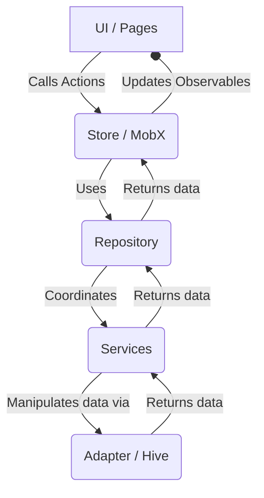

# App Flashcards 🗂️

A mobile application developed in Flutter to create and manage flashcard decks. Ideal for students and anyone looking to memorize information in a practical and efficient way.

## 📝 About the Project

**App Flashcards** was developed as a solution to the flashcard application challenge. The app allows creating different deck categories, managing study cards, and taking interactive quizzes to test learning progress.

## 🖼️ Preview


## ✨ Features

- **Empty State:** Displayed when the user has no registered decks, featuring a shortcut to create their first deck.
- **Deck List:** Lists registered decks showing their name and updated card count.
- **Deck Creation:** Simple interface to register a new deck by providing only its name.
- **Deck Removal:** Delete a deck by pressing and holding the item (Long Press) or swiping left (Dismissible).
- **Deck Details:** Displays the deck name, total cards, a button to add new cards, and a button to start the Quiz.
- **Card Registration:** Allows adding cards composed of a **question** and an **answer**.
- **Count Synchronization:** Card quantity updates automatically on the details page and main list after additions.
- **Local Persistence:** All your decks and cards are saved directly on the device, enabling offline usage.
- **Interactive Quiz Flow:**
  - Displays the card question initially.
  - Allows toggling visibility between question and answer.
  - Buttons for the user to mark **Correct** or **Incorrect**.
  - Current card progress indicator (e.g., `2/10`).
  - Completion message at the end of the quiz displaying the total score achieved.

## 🛠️ Architecture & Technologies

The project was built following clean architecture principles to ensure decoupled, testable, and easily maintainable code.

- [**Dart**](https://dart.dev/): Programming language used by Flutter.
- [**Flutter**](https://flutter.dev/): Framework for cross-platform application development.
- [**MobX**](https://mobx.pub/): Reactive and predictable state management.
- [**Hive_ce**](https://hive.dev/): Lightweight and extremely fast NoSQL database.
- [**GetIt**](https://pub.dev/packages/get_it): Service locator for layer decoupling.

### Layer Structure

Data flow in the application follows a single direction, making information tracking and debugging easier.

1.  **UI (Pages/Widgets):** Presentation layer, responsible for displaying data and capturing user interactions.
    -   Location: `lib/pages/`
2.  **Store (MobX):** Acts as a ViewModel, managing UI state and connecting it to business logic.
    -   Location: `lib/pages/home/store/`
3.  **Repository:** Abstracts the data source. It delegates calls to appropriate services without exposing implementation details.
    -   Location: `lib/repositories/`
4.  **Service:** Contains business logic specific to each use case (e.g., create a deck, add a card).
    -   Location: `lib/services/`
5.  **Adapter:** Outermost layer, responsible for communicating with the database (Hive). Implements an interface so it can be easily replaced if necessary.
    -   Location: `lib/adapters/`



## 🚀 How to Run the Project

To run this project on your local machine, you will need Flutter installed. Then follow the steps below:

1.  **Clone the repository** (if using git):
    ```bash
    git clone https://github.com/ludson96/4-app-flashcards.git

    cd 4-app-flashcards
    ```

2.  **Install dependencies** using Flutter:
    ```bash
    flutter pub get
    ```

3.  **Run the application**:
    ```bash
    flutter run
    ```
