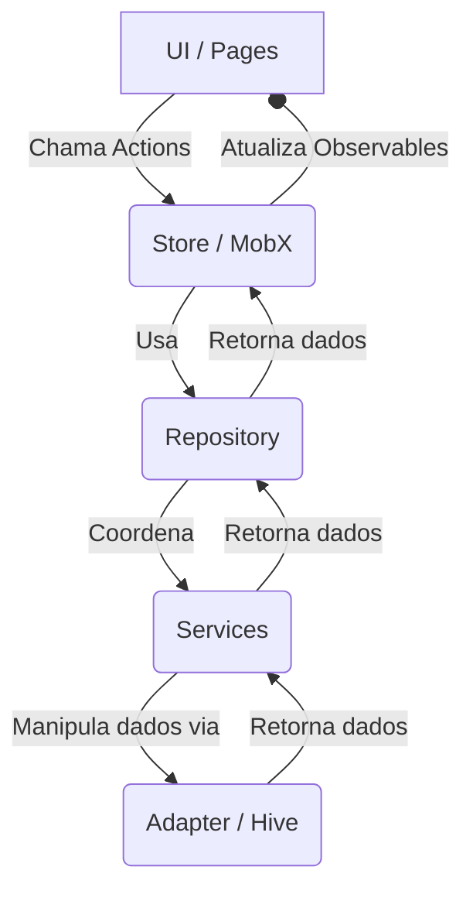

# App Flashcards 🗂️

Um aplicativo móvel desenvolvido em Flutter para criar e gerenciar baralhos de flashcards. Ideal para estudantes e qualquer pessoa que queira memorizar informações de forma prática e eficiente.

## ✨ Funcionalidades

- **Criar Decks:** Crie novos baralhos (decks) de estudo com títulos personalizados.
- **Adicionar Cartões:** Adicione cartões com uma pergunta na frente e uma resposta no verso a qualquer um dos seus decks.
- **Listagem Centralizada:** Visualize todos os seus decks em uma tela principal.
- **Remover Decks:** Exclua decks que não são mais necessários.
- **Persistência Local:** Todos os seus decks e cartões são salvos diretamente no dispositivo, permitindo o uso offline.

## 🛠️ Arquitetura e Tecnologias

O projeto foi construído seguindo princípios de arquitetura limpa para garantir um código desacoplado, testável e de fácil manutenção.

*   **Framework:** [Flutter](https://flutter.dev/)
*   **Linguagem:** [Dart](https://dart.dev/)
*   **Gerenciamento de Estado:** [MobX](https://mobx.pub/) - Para um gerenciamento de estado reativo e previsível.
*   **Banco de Dados Local:** [Hive](https://hive.dev/) - Um banco de dados NoSQL chave-valor, leve e extremamente rápido.
*   **Injeção de Dependência:** [get_it](https://pub.dev/packages/get_it) - Para desacoplar as camadas da aplicação.

### Estrutura das Camadas

O fluxo de dados na aplicação segue uma direção única, facilitando o rastreamento de informações e a depuração.

1.  **UI (Pages/Widgets):** Camada de apresentação, responsável por exibir os dados e capturar as interações do usuário.
    -   Local: `lib/pages/`
2.  **Store (MobX):** Atua como um ViewModel, gerenciando o estado da UI e conectando-a com a lógica de negócio.
    -   Local: `lib/pages/home/store/`
3.  **Repository:** Abstrai a origem dos dados. Ele delega as chamadas para os serviços apropriados, sem conhecer os detalhes de implementação.
    -   Local: `lib/repositories/`
4.  **Service:** Contém a lógica de negócio específica para cada caso de uso (ex: criar um deck, adicionar um cartão).
    -   Local: `lib/services/`
5.  **Adapter:** A camada mais externa, responsável pela comunicação com o banco de dados (Hive). Implementa uma interface para que possa ser facilmente substituída se necessário.
    -   Local: `lib/adapters/`



## 🚀 Como Executar

1.  **Clone o repositório:**
    ```sh
    git clone <URL_DO_SEU_REPOSITORIO>
    ```
2.  **Instale as dependências:**
    ```sh
    flutter pub get
    ```
3.  **Execute o aplicativo:**
    ```sh
    flutter run
    ```
