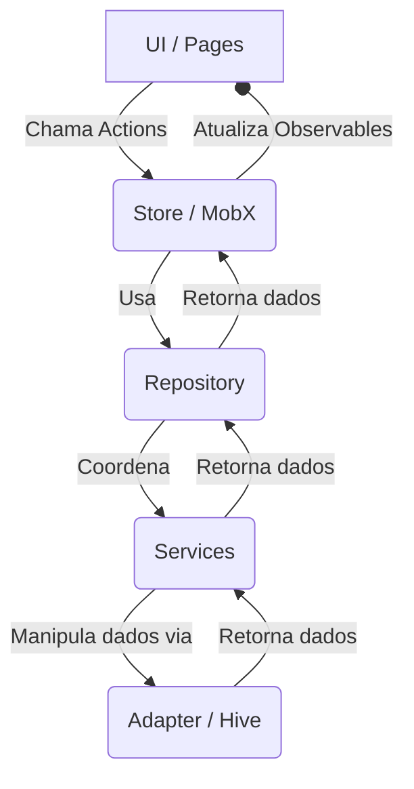

# App Flashcards 🗂️

Um aplicativo móvel desenvolvido em Flutter para criar e gerenciar baralhos de flashcards. Ideal para estudantes e qualquer pessoa que queira memorizar informações de forma prática e eficiente.

## 📝 Sobre o Projeto

O **App Flashcards** foi desenvolvido como solução para o desafio de criação de uma aplicação de cartões de memória (flash cards). O aplicativo permite criar diferentes categorias de baralhos, gerenciar cartões de estudo e realizar questionários interativos para testar o aprendizado.

## 🖼️ Tela (Preview)


## ✨ Funcionalidades

- **Estado Vazio (Empty State):** Página exibida quando o usuário não possui baralhos cadastrados, com atalho para criar o primeiro baralho.
- **Listagem de Baralhos:** Lista os baralhos cadastrados exibindo o nome e a quantidade atualizada de cartões de cada um.
- **Criação de Baralho:** Interface simples para cadastro de um novo baralho informando apenas o nome.
- **Remoção de Baralho:** Exclusão do baralho ao manter o dedo pressionado em cima do item desejado (Long Press) ou arrastando para a esquerda (Dismissible).
- **Detalhes do Baralho:** Exibe o nome do baralho, total de cartões, botão para adicionar novos cartões e botão para iniciar o Quiz.
- **Cadastro de Cartão:** Permite adicionar cartões compostos por uma **pergunta** e uma **resposta**.
- **Sincronização da Contagem:** A quantidade de cartões atualiza automaticamente na página de detalhes e na listagem principal após cadastros.
- **Persistência Local:** Todos os seus decks e cartões são salvos diretamente no dispositivo, permitindo o uso offline.
- **Fluxo do Quiz Interativo:**
  - Exibe inicialmente a pergunta do cartão.
  - Permite alternar a visualização entre pergunta e resposta.
  - Botões para o usuário indicar se **Acertou** ou **Errou**.
  - Indicador do progresso atual dos cartões (exemplo: `2/10`).
  - Mensagem de encerramento ao final do quiz exibindo a quantidade total de pontos alcançados.

## 🛠️ Arquitetura e Tecnologias

O projeto foi construído seguindo princípios de arquitetura limpa para garantir um código desacoplado, testável e de fácil manutenção.

- [**Dart**](https://dart.dev/): Linguagem de programação utilizada pelo Flutter.
- [**Flutter**](https://flutter.dev/): Framework para desenvolvimento de aplicações multiplataforma.
- [**MobX**](https://mobx.pub/): Gerenciamento de estado reativo e previsível.
- [**Hive_ce**](https://hive.dev/): Banco de dados NoSQL leve e extremamente rápido.
- [**GetIt**](https://pub.dev/packages/get_it): Desacoplamento das camadas da aplicação.

### Estrutura das Camadas

O fluxo de dados na aplicação segue uma direção única, facilitando o rastreamento de informações e a depuração.

1.  **UI (Pages/Widgets):** Camada de apresentação, responsável por exibir os dados e capturar as interações do usuário.
    -   Local: `lib/pages/`
2.  **Store (MobX):** Atua como um ViewModel, gerenciando o estado da UI e conectando-a com a lógica de negócio.
    -   Local: `lib/pages/home/store/`
3.  **Repository:** Abstrai a origem dos dados. Ele delega as chamadas para os serviços apropriados, sem conhecer os detalhes de implementação.
    -   Local: `lib/repositories/`
4.  **Service:** Contém a lógica de negócio específica para cada caso de uso (ex: criar um deck, adicionar um cartão).
    -   Local: `lib/services/`
5.  **Adapter:** A camada mais externa, responsável pela comunicação com o banco de dados (Hive). Implementa uma interface para que possa ser facilmente substituída se necessário.
    -   Local: `lib/adapters/`


```mermaid
graph TD
    A[UI / Pages] -->|Chama Actions| B(Store / MobX);
    B -->|Usa| C(Repository);
    C -->|Coordena| D(Services);
    D -->|Manipula dados via| E(Adapter / Hive);
    E -->|Retorna dados| D;
    D -->|Retorna dados| C;
    C -->|Retorna dados| B;
    B --o|Atualiza Observables| A;
```

## 🚀 Como Executar o Projeto

Para rodar este projeto em sua máquina local, você precisará ter o Flutter instalado. Depois, siga os passos abaixo:

1.  **Clone o repositório** (se estiver usando git):
    ```bash
    git clone https://github.com/ludson96/4-app-flashcards.git

    cd 4-app-flashcards
    ```

2.  **Instale as dependências** com o Flutter:
    ```bash
    flutter pub get
    ```

3.  **Execute o aplicativo**:
    ```bash
    flutter run
    ```
